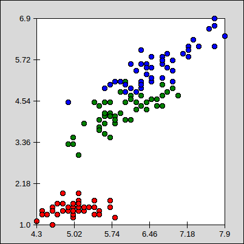
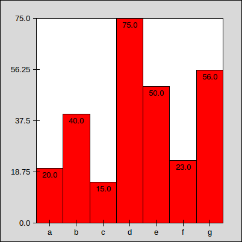
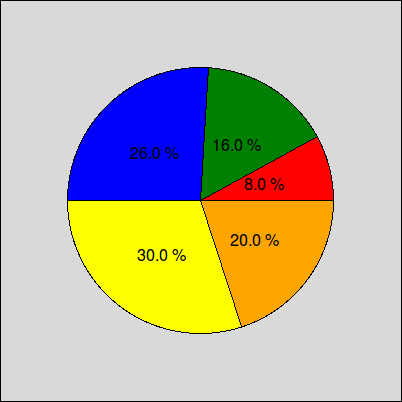
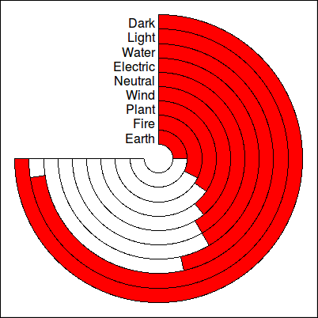

# Fun Fun Plot
## A Python 2D declarative plotting library

**Fun Fun Plot** is a library for making 2D plots of arrays in [Python](https://www.python.org/) through a declarative approach. All plots are constructed by combining primitive elements (lines, rectangles, circles, arcs, ...), associating the parameters of these primitives with values or characteristics of data sets.

For example, in a scatter plot, each data `pi = (xi, yi)` is graphically represented by a circle `(x, y, r)`, where the first attribute `xi` encodes the position on the `x` axis, and the second attribute `yi` encodes the position on the `y` axis, being `r` an arbitrary radius. This is expressed in **Fun Fun Plot** as follows:

```python
ScatterPlot = Plot(
    Data(                     # For each data x = (x0, x1)
        Circle(               #  | draw a circle with
            Xnormal(Attr(0)), #     | center x in x[0],
            Ynormal(Attr(1)), #     | center y in x[1],
            4                 #     | and radius 4
        )
    ),
    # (...) options of the plot
)
```
Now, you can plot any data set by calling the `draw()` method of `ScatterPlot` (check out the [examples](#examples) section to see complete examples).


## License
Source code is released under the terms of the [BSD 3-Clause License](LICENSE).


## Examples
#### Scatter Plot

```python
ScatterPlot = Plot(
    Axis(
        Data(
            Circle(
                Xnormal(Attr(0)),
                Ynormal(Attr(1)),
                4,
                background_color = ClassColor(Attr(2))
            )
        )
    ),
    ffp_tkinter, width = 400, height = 400
)
```

```python
ScatterPlot.draw(iris)
```




#### Bar Plot

```python
BarPlot = Plot(
    Axis(
        Data(
            Rectangle(
                Index * (Width / DataLen),
                0,
                Width / DataLen,
                Ynormal(Attr(0)),
                background_color = ClassColor(Attr(2))
            ) +
            Text(
                (0.5 + Index) * (Width / DataLen),
                Ynormal(Attr(0)) - 10,
                Attr(0),
                font_size = 10
            )
        ),
        xticks = Range(DataLen, Width/DataLen/2, Width/DataLen),
        xlabels = Column(1)
    ),
    ffp_tkinter, width = 400, height = 400
)
```

```python
BarPlot.draw([
    [20.0, "a", "class"],
    [40.0, "b", "class"],
    [15.0, "c", "class"],
    [75.0, "d", "class"],
    [50.0, "e", "class"],
    [23.0, "f", "class"],
    [56.0, "g", "class"]
])
```




#### Pie Plot

```python
PiePlot = Plot(
    Data(
        Empty(
            Get("angle", 0) + Get("alpha", 0) >> "angle"
        ) +
        Pie(
            Width/2,
            Height/2,
            Width/3 >> "radius",
            Get("angle"),
            Attr(0) * 360 / Call(sum)(Column(0)) >> "alpha",
            background_color = ClassColor(Attr(1))
        ) +
        Text(
            Width/2 + Call(cos)((Get("angle") + Get("alpha")/2)*pi/180) * Get("radius")/2,
            Height/2 + Call(sin)((Get("angle") + Get("alpha")/2)*pi/180) * Get("radius")/2,
            Call(str)(Get("alpha") / 3.6) + " %",
            font_size = 12
        )
    ),
    ffp_tkinter, width = 400, height = 400
)
```

```python
PiePlot.draw([
    [20.0, "a"],
    [40.0, "b"],
    [65.0, "c"],
    [75.0, "d"],
    [50.0, "e"]
])
```




#### Radial Bar Plot

```python
RadialBarPlot = Plot(
    Rectangle(0, 0, Width, Height, background_color = "white", border_width = 0) +
    Data(
        Pie(
            Width / 2,
            Height / 2,
            Width / 2 / (DataLen + 2) * (DataLen - Index + 1) >> "height",
            90,
            -270,
            background_color = "white"
        ) +
        Pie(
            Width / 2,
            Height / 2,
            Get("height"),
            90,
            Normal(Attr(0), Column(0)) * (-180) - 90,
            background_color = ClassColor(Attr(2))
        ) +
        Text(
            Width / 2,
            Height / 2 + Get("height") - 10,
            Attr(1) + " ",
            text_align = "right",
            font_size = 12
        )
    ) +
    Circle(
        Width / 2,
        Height / 2,
        Width / 2 / (DataLen + 2),
        background_color = "white",
        border_width = 0
    ) +
    Arc(
        Width / 2,
        Height / 2,
        Width / 2 / (DataLen + 2),
        90,
        -270
    ),
    ffp_tkinter, width = 400, height = 400
)
```

```python
RadialBarPlot.draw([
    [27.0, "Dark",     "class"],
    [26.0, "Light",    "class"],
    [15.0, "Water",    "class"],
    [13.0, "Electric", "class"],
    [13.0, "Neutral",  "class"],
    [12.0, "Wind",     "class"],
    [10.0, "Plant",    "class"],
    [9.0,  "Fire",     "class"],
    [6.0,  "Earth",    "class"]
])
```




