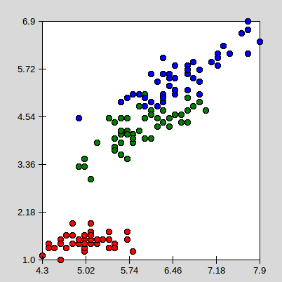
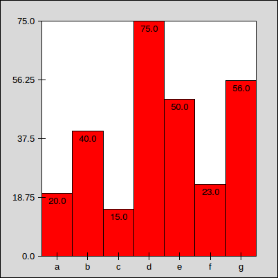
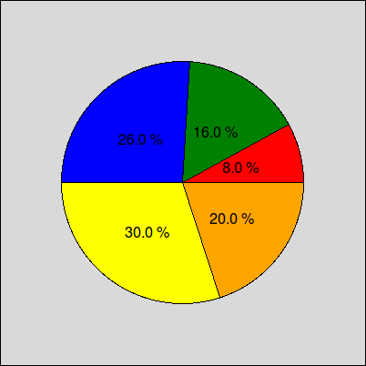

# Fun Fun Plot
## A Python 2D declarative plotting library

## Examples
#### Scatter Plot

```python
ScatterPlot = Plot(
    Axis(
        Data(
            Circle(
                Xnormal(Attr(Zero)),
                Ynormal(Attr(One)),
                Four,
                background_color = ClassColor(Attr(Two))
            )
        )
    ),
    ffp_tkinter, width = 400, height = 400
)
```

```python
ScatterPlot.draw(iris)
```




#### Bar Plot

```python
BarPlot = Plot(
    Axis(
        Data(
            Rectangle(
                Index * (Width / DataLen),
                Zero,
                Width / DataLen,
                Ynormal(Attr(Zero)),
                background_color = ClassColor(Attr(Two))
            ) +
            Text(
                (Cons(0.5) + Index) * (Width / DataLen),
                Ynormal(Attr(Zero)) - Cons(10),
                Attr(Zero),
                font_size = Cons(10)
            )
        ),
        xticks = Range(DataLen, Width/DataLen/Two, Width/DataLen),
        xlabels = Column(One)
    ),
    ffp_tkinter, width = 400, height = 400
)
```

```python
BarPlot.draw([
    [20.0, "a", "class"],
    [40.0, "b", "class"],
    [15.0, "c", "class"],
    [75.0, "d", "class"],
    [50.0, "e", "class"],
    [23.0, "f", "class"],
    [56.0, "g", "class"]
])
```




#### Pie Plot

```python
PiePlot = Plot(
    Data(
        Empty(
            Get("angle", Zero) + Get("alpha", Zero) >> Cons("angle")
        ) +
        Pie(
            Width/Two,
            Height/Two,
            Width/Three >> Cons("radius"),
            Get("angle"),
            Attr(Zero) * Cons(360) / Sum(Column(Zero)) >> Cons("alpha"),
            background_color = ClassColor(Attr(One))
        ) +
        Text(
            Width/Two + Cos(Radians(Get("angle") + Get("alpha")/Two)) * Get("radius")/Two,
            Height/Two + Sin(Radians(Get("angle") + Get("alpha")/Two)) * Get("radius")/Two,
            Str(Get("alpha") / Cons(3.6)) + Cons(" %"),
            font_size = Cons(12)
        )
    ),
    ffp_tkinter, width = 400, height = 400
)
```

```python
PiePlot.draw(
    [20.0, "a"],
	[40.0, "b"],
	[65.0, "c"],
	[75.0, "d"],
	[50.0, "e"])
```




## License
Source code is released under the terms of the [BSD 3-Clause License](LICENSE).
